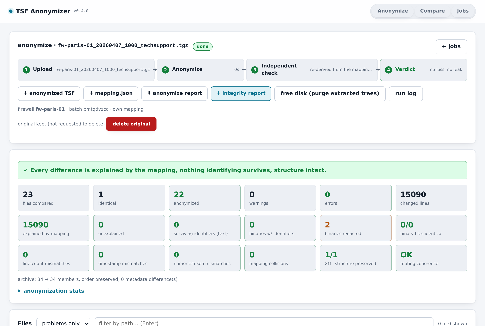

# TSF Anonymizer

[](https://github.com/tbortolossi/tsf-anonymizer/actions/workflows/ci.yml)
[](https://github.com/tbortolossi/tsf-anonymizer/actions/workflows/codeql.yml)
[](https://github.com/tbortolossi/tsf-anonymizer/releases)
[](pyproject.toml)
[](LICENSE)
[](https://github.com/astral-sh/uv)

**Anonymize Palo Alto Networks PAN-OS tech support files (TSF) before
sharing them — without losing what makes them useful for troubleshooting —
and prove it with an independent compare mode.**

A tech support file is the archive a PAN-OS firewall or Panorama produces
for a support case: every config, every daemon log, the command dump. It
names the customer on every line — hostnames, internal and public IPs, LDAP
domains, usernames, e-mail recipients, serial numbers, rule and object
names. This tool replaces all of that with **consistent pseudonyms** (same
original → same fake everywhere, so VPN peers, users and rules still
correlate across logs and config), keeps everything else byte for byte
(timestamps, counters, line numbers, interface names, binary files, archive
order and metadata), and then **verifies its own output** with a second,
independent implementation that re-derives every change from the mapping.

Standalone: one Python package, one container, a web UI and a CLI, no
external service, nothing leaves your machine.

**Behaviour stays, identity leaves.** The anonymized copy is meant to be
analysed *instead of* the original — by TAC, by a colleague, by an LLM.
What happened is all there: sequences, timings, counters, which rule, zone,
gateway or daemon, what was committed just before, under pseudonyms that stay
consistent across every file. Who it happened to is not: hostnames, serials,
IPs, users, e-mails, object names — and, by default, the binary files that
embed them. On a security incident that means the *method* is readable on
the copy (a burst of failed logins from one pseudonymised source, the guessed
names, what happened next) while the *attribution* — the real address,
account, device — needs the mapping sidecar, which stays with the owner.



- [What it does](#what-it-does)
- [Run it](#run-it) · [Docker Compose](#docker-compose-recommended) · [Try it without a real TSF](#try-it-without-a-real-tsf) · [Batches](#batches)
- [Measured on a real TSF](#measured-on-a-real-tsf)
- [Known limitations](#known-limitations)
- [Docs](docs/user-guide.md): [user guide](docs/user-guide.md) · [architecture](docs/architecture.md) · [what a TSF contains](.claude/skills/read-tsf/TSF-GUIDE.md)
- [Contributing](CONTRIBUTING.md) · [Security policy](SECURITY.md) · [Changelog](CHANGELOG.md)

## What it does

**Anonymize** — extracts the `.tgz`, pre-scans every XML config for named
objects (addresses, zones, rules, gateways, users, …), hostnames, LDAP domains,
certificate subjects, e-mail recipients and serials, then rewrites every text
file (rotated `.gz` logs included) with consistent pseudonyms:

| class | original | replacement |
|---|---|---|
| private IPv4 | `10.1.2.3` | `10.x.y.3` — same class, same last octet; same real subnet → same fake subnet |
| public IPv4 | `8.8.8.8` | `240.x.y.z` (class E, never routable) — one fake `/24` per real `/24` |
| FQDN / hostname | `fw01.acme.local` | `host007.anon.internal` |
| e-mail | `j.dupont@acme.fr` | `user003@host002.anon.internal` |
| named object | `Zone-Prod-DMZ` | `ZONE-0012` (category prefix kept) |
| username | `jdupont` | `user001` |
| serial | `001901000123` | `900000000001` (same length, leading 9) |

Same original value → same pseudonym everywhere, so VPN peers, LDAP servers,
rules and users can still be correlated across logs and config.

What is **not** touched: PAN-OS interface names (`ethernet1/1`, `ae1`, `tunnel.1`),
built-in objects (`any`, `trust`, `vsys1`, `admin`…), vendor domains
(`*.paloaltonetworks.com`), netmasks, loopback/multicast/link-local addresses,
timestamps, counters, and every binary file (copied through byte for byte).

The output archive keeps the input's member order and metadata; only payloads
change. A `<name>.mapping.json` sidecar records every substitution — **it is the
key to the customer's identity: keep it with the customer, never with the
anonymized TSF.**

**Compare** — reads the original and the anonymized archive back and checks,
independently of the anonymizer:

1. every changed line is explained by the mapping (token-level re-application,
   then span-level inspection; what remains is *unexplained* and shown for review);
2. no mapping key survives in any text file — and binary files, which are not
   rewritten, are scanned for identifiers too and flagged as warnings. Some
   binary formats embed thousands of them (`sslvpn-task.log*.gz` carries the
   source IP and username of every GlobalProtect request; `wtmp`/`btmp` hold
   admin login IPs, `sar` headers the hostname). **Redact binaries** — on by
   default in the UI and the API, `--redact-binaries` on the CLI — replaces
   such payloads with a marker instead; the text twins (`sarNN`,
   `rule-hit-count-db.txt`, `show_log_globalprotect.txt`) are anonymized
   normally, so nothing an analysis needs is lost, and the verification
   checks each redaction was warranted against the original;
3. line counts, timestamp counts, short-numeric-token counts (counters, PIDs,
   sizes) and the XML tag sequence are identical on both sides;
4. binary files are byte-identical; archive members, order and metadata match.

The web UI shows the verdict, per-file status, and a side-by-side diff with
the replaced spans highlighted (red outline = change the mapping does not explain).

**Delete the original after a clean verification** (on by default for
anonymize jobs): once the compare finds no error, the un-anonymized upload and
its extracted tree are removed from the server; only the anonymized archive,
the mapping and the reports remain. If the check finds problems, the original
is kept for review and the job says why — a *delete original now* button does
it once you have looked. CLI: `--verify --delete-original`.

New to TSFs? [TSF-GUIDE.md](.claude/skills/read-tsf/TSF-GUIDE.md) explains what a tech
support file contains, where each kind of information lives, which daemon
log to read for which problem, and how to read an anonymized one. The
[user guide](docs/user-guide.md) walks through the UI screen by screen;
[architecture.md](docs/architecture.md) explains the pipeline.

## Run it

### Docker Compose (recommended)

```bash
cat > .env <<EOF          # gitignored; compose reads it automatically
TSF_UID=$(id -u)
TSF_GID=$(id -g)
TSF_PASSWORD=$(python3 -c "import secrets;print(secrets.token_urlsafe(18))")
EOF
scripts/make-tls-cert.sh              # TLS material in ./certs (gitignored)
docker compose up -d --build
open https://127.0.0.1:8096           # user: admin, password: the one in .env
```

Two things are required, both by design, because this UI serves the
*un*-anonymized archive and the mapping that reverses every pseudonym:

- **`TSF_PASSWORD`** — HTTP Basic auth on every route, `/api/health` and
  `/static` included. Compose refuses to start without it. `TSF_USERNAME`
  defaults to `admin`.
- **A certificate** — `scripts/make-tls-cert.sh` creates a local CA and a
  server certificate for the addresses the UI answers on. A *missing*
  certificate stops the container rather than quietly downgrading to plain
  HTTP; `TSF_TLS_CERT=` (empty) is the explicit opt-out.

Import `certs/ca.crt` into the browser or OS trust store, once per machine,
and the padlock is green. Re-running the script reissues the server
certificate and keeps the CA, so the import holds. With a certificate from a
real CA, point `TSF_TLS_CERT` / `TSF_TLS_KEY` at it instead.

To reach the UI from another machine on a trusted LAN, add its address to
`.env`, reissue the certificate for that name, and recreate:

```bash
echo "TSF_BIND_ADDR=10.0.0.246" >> .env    # or 0.0.0.0 for every interface
scripts/make-tls-cert.sh
docker compose up -d --force-recreate
```

Note that publishing on a LAN address means the port is *only* on that
address: use `https://<that address>:8096` from the host too.

### Try it without a real TSF

```bash
tsf-anonymizer mock-tsf              # writes fw-paris-01_20260407_1000_techsupport.tgz
```

A small, complete, entirely fictional archive — configs, rotated daemon
logs, the command dump, binaries that embed identifiers — that runs through
anonymize and verify in a second. Drop it on the UI, or pass it to the CLI
below. It is also what every screenshot in the docs was taken from.

### Where the archives live

Everything a job touches stays under `./data/jobs/<id>/` on the host —
gitignored, never sent anywhere:

```
data/jobs/<id>/input/       the TSF you uploaded, un-anonymized
               work/orig/   its extracted tree      } deleted by "free disk"
               work/anon/   the anonymized tree     } (the diff viewer needs them)
               output/      <name>_anon.tgz, <name>_anon.mapping.json,
                            anonymize-report.json, integrity-report.json,
                            job.log
               job.json     status, summaries, firewall, batch and seed of the job
```

A 300 MB TSF extracts to ~1.5 GB, kept twice so the diff viewer can read both
sides. *Delete the original after a clean verification* (checked by default)
removes `input/` and `work/orig/` as soon as the integrity check comes back
clean; when it does not, the original is kept for review and the job says so.

### When a job fails

Every run writes its own `output/job.log`: what it did, every file the
anonymizer had to skip, and — if it crashed — the traceback. The job page
shows it (it opens by itself on a failure) and offers it as a download, so a
bug report is a file, not a `docker compose logs` transcript that the next
`--force-recreate` throws away. `GET /api/jobs/<id>/log?tail=N` returns the
last N lines as JSON.

### Following a run

The jobs list refreshes itself every 2 seconds while anything is queued or
running: each running job shows its phase, a percentage and how long it has
been going, each queued one its position in the queue. A phase that stops
reporting is called out (*quiet for 4m*) rather than left to look identical to
a slow one — `extract`, `copy` and `repack` count members, so the bar moves
during the long phases too, not only while files are being rewritten.

### How fast, and how many at once

The service runs **several archives at once** (`TSF_WORKERS`, default `cpu/4`
capped at 4) and spreads each job's heavy passes over worker *processes*: the
text prescan and the rewrite (`TSF_ANON_WORKERS`) as well as the verification
(`TSF_COMPARE_WORKERS`, which `TSF_ANON_WORKERS` defaults to — the two phases
of one job never overlap, so they share the same budget). Processes, not
threads: Python threads serialise CPU work on the GIL, which is how a
"parallel" batch once ran on a single core. The mapping does not depend on the
worker count — identities are all discovered and numbered before the parallel
rewrite starts — so `workers=1` and `workers=8` produce byte-identical output.
A batch of unrelated firewalls fans out; archives chained to the same firewall
still run in order, because a job may not start before the one it seeds from
has finished.

All three are empty by default in `docker-compose.yml`, which means "decide
from the core count"; set them to pin the load, e.g. `TSF_WORKERS=2` on a
small host. `GET /api/health` reports what the service settled on.

If a job was interrupted — a restart in the middle of a batch — **run again**
on its page requeues it from the upload already on disk
(`POST /api/jobs/<id>/requeue`); nothing has to be uploaded twice.

### Batches

Drop several TSFs at once. They are uploaded and processed one at a time, and
you choose what the batch shares:

- **One shared mapping** — one firewall, or one customer, across several
  archives: each job seeds from the previous one, so an identifier keeps the
  same pseudonym everywhere and the mapping keeps growing. A job that fails is
  stepped over, not cascaded.
- **One mapping per firewall** — several devices in the same drop: each file
  carries the name of its firewall (guessed from the filename, editable next to
  the file). Archives of the same firewall share a growing mapping; different
  firewalls stay unrelated, so nothing links an identifier from one device to
  another.
- **A separate mapping per TSF** — unrelated archives: nothing links an
  identifier from one to another.

The firewall name is also what makes a mapping outlive the batch: upload a TSF
next month under the same name and it continues that device's mapping instead
of starting over — no `mapping.json` to keep around. An uploaded `mapping.json`
still wins, and seeds the first archive of each mapping before travelling down
the chain.

CLI (same code, no container):

```bash
uv tool install git+https://github.com/tbortolossi/tsf-anonymizer   # or pipx
tsf-anonymizer mock-tsf                                               # a synthetic TSF to try it on
tsf-anonymizer anonymize in.tgz --verify --report integrity.json [--delete-original]
tsf-anonymizer compare in.tgz in_anon.tgz --mapping in_anon.mapping.json
tsf-anonymizer anonymize second.tgz --seed-mapping in_anon.mapping.json   # same customer, same pseudonyms
tsf-anonymizer serve --data-dir ./data
```

`--verify` / `compare` exit 2 when the integrity report has errors.

## Measured on a real TSF

PA-440, PAN-OS 12.1, 155 MB archive, 562 members, 1.2 GB extracted, 508 files
(2026-08-30, one core):

| | |
|---|---|
| anonymize + verify | ~10 min |
| mapping | 54 148 IPs · 202 objects · 54 FQDNs · 65 e-mails · 10 serials · 4 usernames |
| changed lines | 891 914 — **100 % explained by the mapping** |
| surviving identifiers (text) | **0** |
| binary files | 42, all byte-identical; 36 embed identifiers (`rule-hit-count.bin`, `wtmp`, `sa*`, `sslvpn-task.log`) |
| archive | same 562 members, same order, same metadata |

The compare mode found twelve defects in the anonymizer inherited from
TAC-MAN before that table read this way — rewritten XML tags, the App-ID
catalog registered as customer objects, chained pseudonyms, counters taken for
serials, URLs left untouched, an apex domain never mapped. They are recorded
as invariants in [.claude/rules/anonymizer-invariants.md](.claude/rules/anonymizer-invariants.md).

## Known limitations

- **A hostname that appears only in logs and never in a config is not
  redacted.** Named objects and FQDNs are discovered from the XML prescan;
  IPs, e-mails, serials and `user '…'` patterns are matched by shape
  everywhere. Free text (login banners, rule descriptions, comments) can
  carry a company name nothing matches.
- **Free text is not scanned.** Rule descriptions, comments, login banners
  can carry a company name that nothing matches. `<contact>` / `<full-name>`
  are anonymized.
- **A pseudonym can coincide with a real address.** Private pseudonyms live
  in the same RFC 1918 class as their originals — that is what keeps subnets
  and routes coherent — so a fake can equal an address the customer also
  uses (~0.1 % measured). It is still replaced; the report lists these under
  *mapping collisions*: ambiguous in the output, not leaked.
- **Binary files are not rewritten.** `rule-hit-count.bin`, sqlite databases
  or core dumps may embed rule names or IPs; the compare report lists which
  ones. Remove them from the archive if that matters.
- Usernames are only caught in the log phrasings the regex knows
  (`for user 'x'`, `user: 'x'`, …). Config-declared users are caught as named
  objects.
- IPv6 is not anonymized; neither are addresses rendered as byte arrays in
  Go debug output (`[0 0 … 255 255 10 0 0 254]`).
- **Routing coherence is checked structurally.** The compare re-parses the
  config (preferring `.merged-running-config.xml` on Panorama-managed
  devices) and both RIB formats on each side and verifies that every
  private structural relation — a nexthop inside a connected subnet, a
  route containing another route or a connected network, every prefix
  length — holds on the anonymized tree *iff* it holds on the original.
  Any injective mapping explains every line; only a prefix-preserving one
  keeps these relations. Divergences involving public space (aggregation
  beyond the per-/24 grouping) are counted and shown, not errors — that is
  the documented trade of mapping public addresses into 240/4.
- **The compare mode only knows the mapping.** It proves every change is
  mapping-driven and that no mapped value survives; it cannot know that a
  string it never mapped is the customer's name. A raw `grep` of the
  anonymized tree for the customer name, domain and site names is the check
  to run on top — it is how the apex-domain gap was found.
- The web UI's auth is a single shared account: no per-user audit trail, no
  rate limiting on failed attempts, no session revocation. TLS protects the
  password on the wire and the archives in transit, but anyone who has that
  one password can download the un-anonymized archive and the mapping that
  reverses every pseudonym. The default self-signed CA is trusted only on the
  machines where you imported it — a browser warning you click through
  proves nothing about who answered.

## Contributing, security, licence

Bug reports and feature requests go through the
[issue templates](https://github.com/tbortolossi/tsf-anonymizer/issues/new/choose);
**never attach a real TSF or a mapping** — extend the mock archive instead.
An identifier that survives anonymization is a
[security report](SECURITY.md), handled privately. Development setup,
workflow and release process are in [CONTRIBUTING.md](CONTRIBUTING.md).

Licensed under [Apache-2.0](LICENSE).
