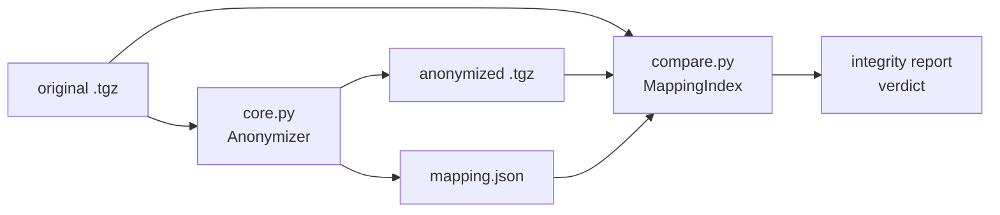
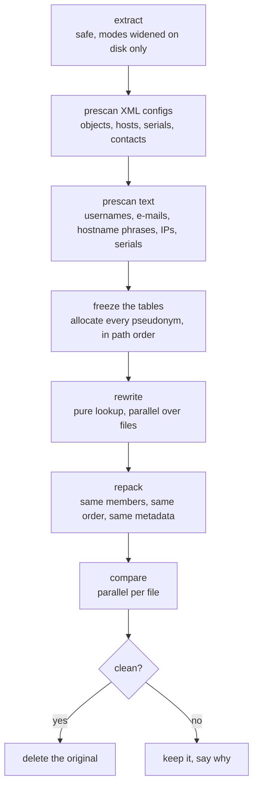

# Architecture

How a tech support file goes in and an anonymized one comes out, and why
the code is shaped the way it is. The *rules* the real-world runs imposed —
several dozen of them — live in [.claude/rules/anonymizer-invariants.md](../.claude/rules/anonymizer-invariants.md) as invariants,
each with the incident that produced it; this page is the map they hang on.

## Two halves that never share code



`core.py` rewrites; `compare.py` verifies. The compare **never imports the
anonymizer** and never asks it whether a change is legitimate: it re-derives
its expectations from the mapping sidecar alone, with its own regexes and
its own boundaries. If the two sides shared replacement logic, a bug there
would be invisible to the check that exists to catch it. The price is
duplication — every boundary rule exists twice, deliberately — and every
boundary the two sides do *not* share shows up as an "unexplained" line or a
"leak" in the report, which is exactly the signal wanted.

## The anonymize pipeline



**Discover everything, then freeze, then rewrite.** Every identity is found
before anything is rewritten: the XML prescan (`prescan_tree`) reads
customer configuration — never vendor content such as the App-ID catalog —
for named objects, hostnames, domains, serials and contacts; the text
prescan (`prescan_text_identities`) sweeps every text file for usernames in
the log phrasings PAN-OS uses, e-mails, `hostname X` phrases, IPs and
serial-shaped numbers. Then the tables freeze. The rewrite is a pure lookup,
which is what makes it safe to run in parallel: pseudonyms were allocated in
path order by the parent process, so the mapping does not depend on how many
workers ran, and `workers=1` vs `workers=N` is asserted byte-identical by
test. Anything the frozen rewrite *would* have allocated is left unchanged
and logged as a warning — a bug to surface, never silent divergence.

**One trie-regex pass per class, never a per-token callback.** Names are
replaced through a longest-match alternation built by `trie_regex()`; the
previous `re.sub(lambda)` took eleven minutes on a 155 MB archive. Objects
and usernames share one trie so the longest key wins whatever its category.

**Bytes in, bytes out.** Text is decoded with `surrogateescape` and written
back as bytes; `\r\n`, Latin-1 stragglers and undecodable bytes survive.
Binary files are never rewritten (a length-prefixed format would be
corrupted), only scanned by the compare and, on request, replaced whole by a
marker. `.gz` members are classified on their decompressed bytes and
recompressed at level 6. No replacement ever contains a newline, so line
counts are invariant — the compare treats a changed line count as an error.

**The output archive is the input archive with payloads swapped.**
`repack_archive` iterates the original `TarInfo` list — order, modes (real
TSFs ship files in mode 0000), owners and mtimes are preserved — and renames
members through the same frozen tables, file names only, never directories.

## Pseudonyms

| class | original | pseudonym | shaped so that |
|---|---|---|---|
| private IPv4 | `10.1.2.3` | `10.x.y.3` | same class + host octet kept: prefix-preserving (keyed PRF tree, `ip_seed` in the sidecar), so subnets and routes stay coherent |
| public IPv4 | `8.8.8.8` | `240.x.y.z` | class E — never routable, never a real third party; one fake /24 per real /24 |
| FQDN / hostname | `fw01.acme.local` | `host007.anon.internal` | parent domains registered down to the apex |
| e-mail | `j.dupont@acme.fr` | `user003@host002.anon.internal` | |
| named object | `Zone-Prod-DMZ` | `ZONE-0012` | category prefix kept, so the config still reads |
| username | `jdupont` | `user001` | replaced everywhere, not only where discovered |
| serial | `001901000123` | `900000000001` | same length, leading `9`: cannot collide with a real one |

Same original → same pseudonym, within a run and across runs seeded with
the same `mapping.json` — for IPs the sidecar also carries `ip_seed`, the
key of the prefix-preserving tree, so a second TSF keeps whole subnets
coherent, not only the addresses both archives share. A pseudonym is never
an input to a later pass (`Anonymizer._fakes`). The IP mapping is injective
(a structural fake that would repeat a used value probes within its /24) and
the compare reports *duplicate pseudonyms* if it ever is not; a fake that
coincides with a real customer address is reported as a *collision*,
separately from leaks.

## Routing coherence

`_routing_view` re-derives, from one tree alone, the connected networks
(config layer3 IPs) and the routes (config static routes + both RIB
formats of the techsupport txt); `check_routing_coherence` requires every
structural relation — nexthop ∈ connected subnet, route ⊆ route,
connected ⊆ route, prefix lengths — to hold on the anonymized side iff it
holds on the original. No mapping involved: this is the check that fails
if prefix preservation ever regresses, which per-line explanation cannot
see. Summary key `routing`, one line in the CLI output, a KPI in the UI.

## The mapping sidecar

`<name>.mapping.json` is a JSON object with one map per class
(`ip_addresses`, `fqdns`, `emails`, `named_objects`, `usernames`,
`serial_numbers`), original → pseudonym. It is the key that reverses the
whole archive and must never travel with the anonymized output. It is also
the *only* thing the compare knows: a string that was never mapped is
invisible to it, which is why a raw `grep` of the output for the customer's
name is the check to run on top.

## The compare

For every file pair, `compare_one` (a pure function of the sidecar, mapped
over a process pool) classifies the file with the same binary heuristic as
the anonymizer, then:

1. re-applies the mapping to the original line by line, in the anonymizer's
   pass order (FQDNs → objects → numeric — a key can contain another class's
   key) and checks the result matches the anonymized line; what does not
   match is inspected span by span, and what remains is *unexplained*;
2. scans the anonymized text for any surviving mapping key (*leaks*), and
   binary files for identifiers they embed (*warnings*);
3. checks line counts, timestamp counts, short-numeric-token counts and the
   XML tag sequence are identical;
4. at archive level, checks members, order and metadata match through the
   mapped names.

Errors (a leak, an unexplained line, a lost line) make the verdict fail and
keep the original; warnings (binary files with identifiers, collisions) do
not.

## Jobs, batches, chains

`jobs.py` keeps one directory per job under `$TSF_DATA_DIR/jobs/<id>/`
(`input/`, `work/orig`, `work/anon`, `output/`, `job.json` persisted on every
transition, `output/job.log` teed from the package logger for that job's
thread only). `TSF_WORKERS` archives run at once; each one's heavy passes
run in `forkserver` worker processes because Python threads serialise CPU
work on the GIL, and forkserver rather than fork because the parent is a
threaded server.

A batch does not fan out blindly: a job that seeds from another (`seed_from`)
waits *in the queue* until the whole chain ahead of it is finished, never
inside a worker, so a pool cannot deadlock on its own chain. Chains are
per **group** — the firewall an archive comes from — so several firewalls in
one drop fan out while several archives of one firewall run in order and
share a growing mapping. A failed job is stepped over, not cascaded.

## The web UI

FastAPI routes in `web/app.py`, vanilla HTML/JS in `web/templates` and
`web/static` — no build step. The UI serves the un-anonymized upload and the
mapping that reverses it, so **every** route sits behind HTTP Basic auth as
soon as `TSF_PASSWORD` is set (health probe and static files included), TLS
is fail-closed (a missing certificate stops the server rather than
downgrading to plain HTTP), compose binds loopback by default and the
container runs as the host user. `create_app(password="")` is the open mode
for tests and loopback use. The threat model is spelled out in
[SECURITY.md](../SECURITY.md).

## Where things are

```
tsf_anonymizer/
  core.py        Anonymizer, prescans, rewrite, safe extract, repack
  compare.py     MappingIndex, compare_one, archive check, diff hunks
  jobs.py        JobStore, phases, chains, per-job log
  cli.py         anonymize | compare | serve | healthcheck | mock-tsf
  mock.py        the synthetic TSF the docs and screenshots run on
  web/           FastAPI app, one template, one stylesheet, one script
tests/           pytest; fixtures build a small realistic TSF in memory
scripts/         TLS material, documentation screenshots
docs/            this page, the user guide, the TSF guide
.claude/skills/read-tsf/   how to *read* a TSF (agent skill + human guide)
```
