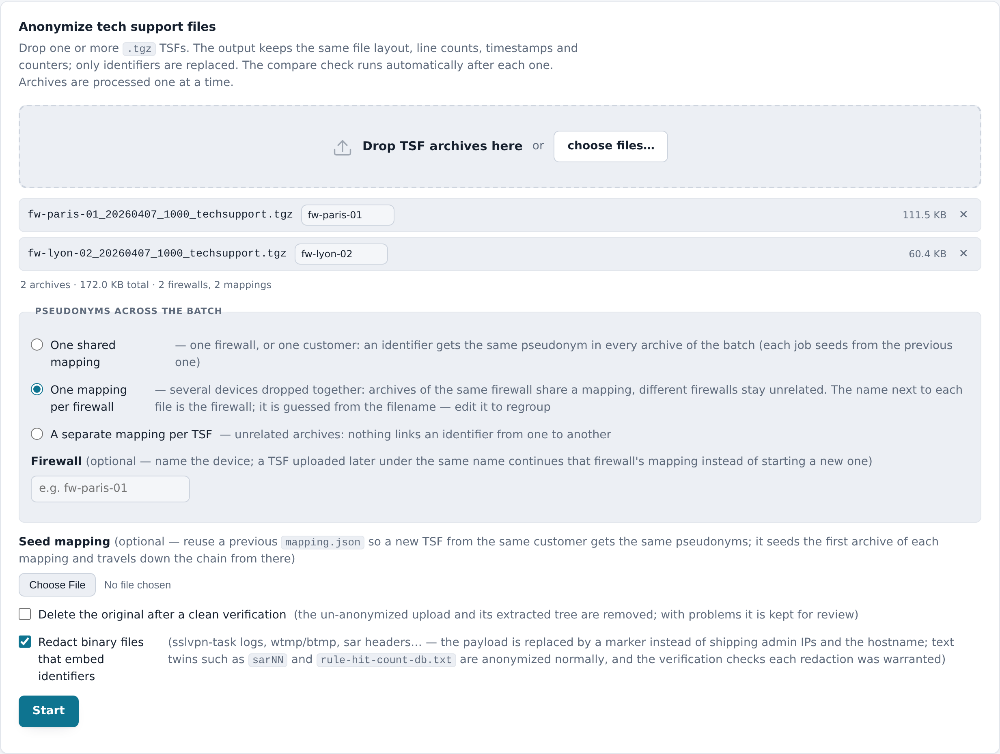
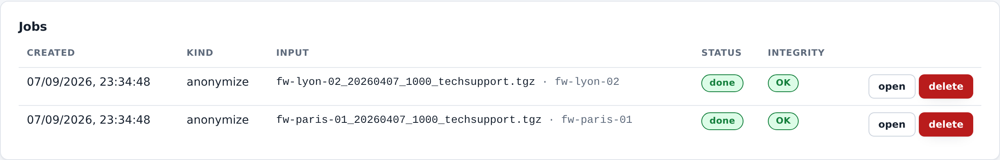
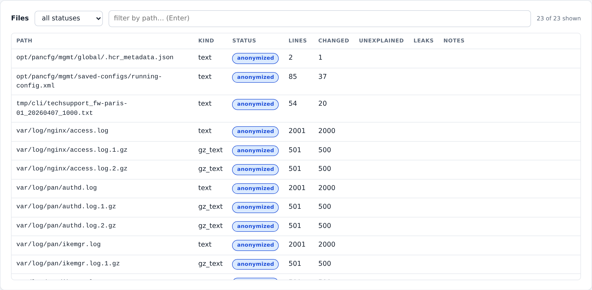
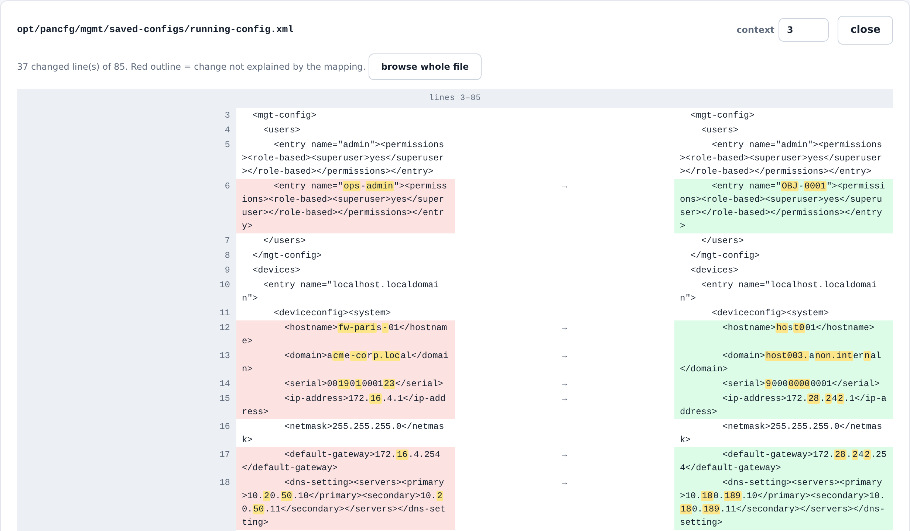
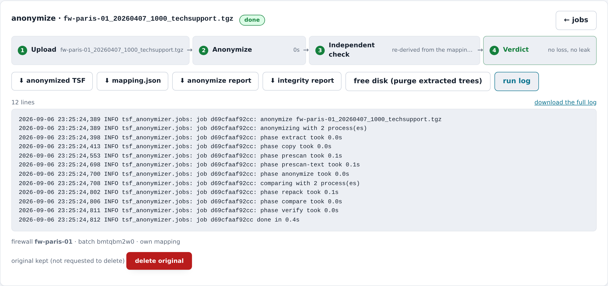
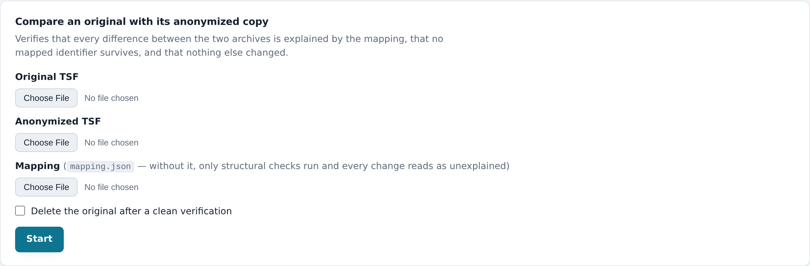

# User guide

A walk through the web UI, from a dropped archive to a verdict, and the CLI
equivalents. Every screenshot below comes from the synthetic archive
`tsf-anonymizer mock-tsf` writes — no real tech support file is ever used
for the docs — and is regenerated by `make screenshots`, so what you see is
what the current version does.

New to tech support files? [TSF-GUIDE.md](../.claude/skills/read-tsf/TSF-GUIDE.md) explains what they
contain and where to look for what. Curious how it works?
[architecture.md](architecture.md).

## Install

**Docker Compose** (recommended — the UI, TLS and auth wired in):

```bash
git clone https://github.com/tbortolossi/tsf-anonymizer.git && cd tsf-anonymizer
cat > .env <<EOF
TSF_UID=$(id -u)
TSF_GID=$(id -g)
TSF_PASSWORD=$(python3 -c "import secrets;print(secrets.token_urlsafe(18))")
EOF
scripts/make-tls-cert.sh          # local CA + server certificate in ./certs
docker compose up -d --build      # https://127.0.0.1:8096 — user admin, password from .env
```

**As a tool** (CLI only, or the UI on loopback):

```bash
uv tool install git+https://github.com/tbortolossi/tsf-anonymizer   # or: pipx install git+…
tsf-anonymizer --version
```

**From a checkout**, for development: `uv sync`, then `uv run tsf-anonymizer …`
(see [CONTRIBUTING.md](../CONTRIBUTING.md)).

## Try it without a real TSF

```bash
tsf-anonymizer mock-tsf                               # fw-paris-01_20260407_1000_techsupport.tgz
tsf-anonymizer anonymize fw-paris-01_*_techsupport.tgz --verify
```

The mock is a small but complete archive — configs, daemon logs with
rotations, the `techsupport_*.txt` command dump, a file in mode 0000, two
binary payloads that embed identifiers — built from a fictional company.
`--lines 20000` makes one large enough to watch the progress bars.

## The web UI

### 1. Drop the archives

Drop one or several `.tgz` on the *Anonymize* tab. Each file gets a
**firewall** name guessed from the filename (PAN-OS names an archive
`<date>_<time>_techsupport.tgz`; what you added around that is the device) —
edit it if the guess is wrong. With several files you choose what the batch
shares:

- **One shared mapping** — one firewall or one customer: every archive gets
  the same pseudonyms, each job seeding from the previous one.
- **One mapping per firewall** — several devices dropped together: archives
  of the same firewall share a growing mapping, different firewalls never
  link an identifier to each other.
- **A separate mapping per TSF** — unrelated archives.

The firewall name outlives the batch: a TSF uploaded next month under the
same name continues that device's mapping. A `mapping.json` from an earlier
run can also be uploaded as a seed; it wins over the chain.

Two checkboxes decide what happens to the data:

- **Delete the original after a clean verification** (on by default): once
  the compare finds no error, the un-anonymized upload and its extracted
  tree are removed from the server. With problems, the original is kept and
  the job says why.
- **Redact binary files that embed identifiers** (on by default): binary
  files are never rewritten; the compare flags those that carry mapped
  values. This option replaces such payloads with a marker instead of
  shipping them — `sslvpn-task.log*.gz` is the usual case, with the source
  IP and username of every GlobalProtect request.



### 2. Follow the batch

Archives are uploaded one after the other and run several at a time
(`TSF_WORKERS`), except that a job chained to another waits for it. The
*Jobs* list refreshes every two seconds while anything is queued or running:
phase, percentage, elapsed time, queue position — and *quiet for 4m* when a
phase has stopped reporting, so a slow run can be told from a hung one.



### 3. Read the verdict

A job page is a flow — upload, anonymize, independent check, verdict — and a
summary of the check. The verdict comes in three shades:

- **green** — every changed line is explained by the mapping, no mapped
  identifier survives, structure intact;
- **amber** — consistent, with warnings to review: typically binary files
  that embed identifiers (they are copied through untouched), or a customer
  address that collides with the fake ranges;
- **red** — a leak, an unexplained change or a lost line. The original is
  kept whatever the checkbox said.

The buttons download the anonymized archive, the mapping, both reports and
the run log. **Keep the mapping with the customer, never with the anonymized
archive** — it reverses every pseudonym.


*Anonymization stats* (collapsed) lists how many values of each class were
replaced and how many distinct ones the mapping holds.

### 4. Files

Every file of the archive with its kind, status, line count, changed lines,
unexplained lines and leaks. The filter defaults to *problems only*; switch
it to see everything. Notes say why a file is a warning or an error
(`3 mapped identifier(s) present in an untouched binary file`).



### 5. Diff viewer

Click a file to see it side by side: original on the left, anonymized on the
right, replaced spans highlighted. A **red outline** marks a change the
mapping does not explain — the thing to look at. The context selector widens
the hunks; long files page through 200-line windows. The viewer needs both
extracted trees, so it is unavailable once the original was deleted or the
trees purged (*free disk*).



### 6. The run log

Each job keeps its own `job.log`: phases with their durations, every file
the anonymizer had to skip, and the traceback if it crashed — the page opens
it by itself on a failure. It is the file to attach to a bug report (after a
look: it names paths, not content).



### 7. Compare two archives

The *Compare* tab runs the check alone: an original, its anonymized copy,
and the mapping. Use it to re-verify an archive produced elsewhere or
earlier. Without the mapping only the structural checks run and every change
reads as unexplained.



## After a clean verdict: the grep

The compare **only knows the mapping**. It proves every change is
mapping-driven and that no mapped value survives; it cannot know that a
string it never mapped is the customer's name. Before sharing, grep the
anonymized tree for the customer's name, domains and site names:

```bash
mkdir out && tar xzf *_anon.tgz -C out
grep -rIl -i -E 'acme|paris|lyon' out | head
```

On the mock archive this finds exactly the two documented limitations:
`nas-paris`, a host that appears only in logs and in no config, and
`O = AcmeCorp` in a certificate subject. That is what the raw grep is for.

## CLI

Same code, no server:

```bash
tsf-anonymizer anonymize in.tgz --verify --report integrity.json          # anonymize + check
tsf-anonymizer anonymize in.tgz --verify --delete-original                # … and delete on success
tsf-anonymizer anonymize next.tgz --seed-mapping in_anon.mapping.json     # same customer, same pseudonyms
tsf-anonymizer anonymize in.tgz --redact-binaries --workers 4             # redaction is on by default in the UI/API, a flag on the CLI
tsf-anonymizer anonymize in.tgz --mapping-only                            # list what would be mapped, write nothing
tsf-anonymizer compare in.tgz in_anon.tgz --mapping in_anon.mapping.json  # check alone
tsf-anonymizer serve --host 127.0.0.1 --port 8090 --data-dir ./data       # the UI, open, loopback
tsf-anonymizer serve --ssl-certfile srv.crt --ssl-keyfile srv.key         # HTTPS (or TSF_TLS_CERT / TSF_TLS_KEY)
tsf-anonymizer mock-tsf -o demo.tgz --lines 5000 --seed 7                 # a synthetic archive; same seed, same bytes
tsf-anonymizer healthcheck --port 8090                                    # probe a local instance (the container HEALTHCHECK)
```

`serve` listens on `0.0.0.0` unless `--host` says otherwise and warns when it
does; it is the container that is published on loopback (`TSF_BIND_ADDR`).
Without `TSF_PASSWORD` it runs open — fine for loopback, nothing else.

`anonymize --verify` and `compare` exit **2** when the report has errors.

## Where the data lives

```
data/jobs/<id>/input/       the upload, un-anonymized
               work/orig/   its extracted tree      } removed by "free disk"
               work/anon/   the anonymized tree     } (the diff viewer needs them)
               output/      <name>_anon.tgz, <name>_anon.mapping.json,
                            anonymize-report.json, integrity-report.json, job.log
               job.json     status, summaries, firewall, batch, seed
```

A 300 MB TSF extracts to ~1.5 GB, kept twice while the trees are there.
`./data` is a bind mount owned by your user (compose runs the container as
`TSF_UID:TSF_GID`), so it can be wiped without `sudo`.

## Configuration

| variable | default | meaning |
|---|---|---|
| `TSF_PASSWORD` | *(required by compose)* | HTTP Basic auth password, every route |
| `TSF_USERNAME` | `admin` | HTTP Basic auth user |
| `TSF_BIND_ADDR` | `127.0.0.1` | address the port is published on (`0.0.0.0` = everywhere) |
| `TSF_PORT` | `8096` | host port |
| `TSF_TLS_CERT` / `TSF_TLS_KEY` | `/certs/server.crt` / `.key` | TLS material; a missing file stops the server; empty = plain HTTP |
| `TSF_WORKERS` | `cpu/4`, max 4 | archives processed at once |
| `TSF_ANON_WORKERS` | = compare workers | processes for one job's prescan and rewrite |
| `TSF_COMPARE_WORKERS` | cores left over, max 4 | processes for one job's verification |

The two per-job counts are floors: when fewer archives can actually run — a
lone upload, or a batch of one firewall, which is a chain — a phase takes the
idle share of the cores instead, up to the whole machine. Setting either
variable pins the count and turns that off.
| `TSF_DATA_DIR` | `/data` | where jobs live |
| `TSF_UID` / `TSF_GID` | *(your `id -u` / `id -g`)* | compose only: the user the container runs as, so `./data` stays yours |

`GET /api/health` reports the values the service settled on.

## Troubleshooting

- **The container refuses to start** — `TSF_PASSWORD` is not set (compose
  makes it mandatory) or `certs/server.crt` is missing (run
  `scripts/make-tls-cert.sh`, or set `TSF_TLS_CERT=` to opt out of TLS).
- **A job says *quiet for Nm*** — the phase stopped reporting. Open the run
  log; a genuinely huge file can take minutes, a crash shows a traceback.
- **A job was interrupted by a restart** — *run again* on its page requeues
  it from the upload on disk.
- **The verdict is red** — open the files table filtered on errors and the
  diff of the first one; the red-outlined span says what the mapping could
  not explain. Report the *pattern* (never the value) as an issue.
- **Disk fills up** — *free disk* on finished jobs purges the extracted
  trees; deleting a job removes everything under its directory.
